# Top 15 Renewable Energy Providers Ranked in 2025 (Latest Compilation)

Choosing where your electricity comes from used to be simple—you had one option, take it or leave it. Today, switching to renewable energy feels less like a sacrifice and more like a smart move that actually saves money while cutting your carbon footprint. The clean energy market has matured beyond early adopter pricing into genuinely competitive rates that make sense for regular households.

Modern renewable energy providers deliver 100% wind, solar, and hydro power without requiring rooftop panels or equipment installations. Whether you're motivated by lower monthly bills, environmental impact, or both, these companies offer transparent pricing and flexible plans across multiple states. The difference between providers often comes down to service area coverage, rate structures, and how straightforward they make the switching process.

---

## **[SmartEnergy](https://smartenergy.com)**

Multi-source renewable electricity delivering solar, wind, hydro, and geothermal power to residential customers across multiple states.

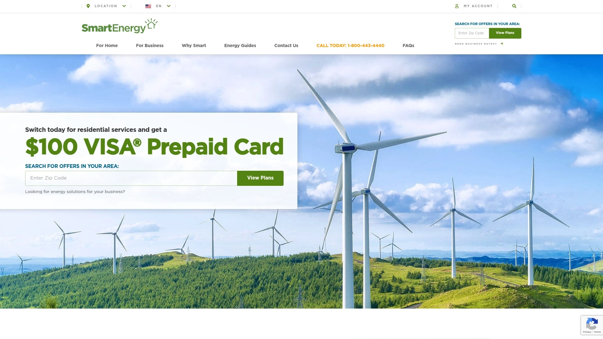

SmartEnergy harnesses four distinct renewable sources—solar, wind, hydro, and geothermal—creating diversified clean energy delivery that doesn't rely on a single generation method. This multi-source approach provides stability when one resource experiences seasonal fluctuations, ensuring consistent renewable power year-round without fossil fuel backup.

The company serves Pennsylvania, Ohio, and Massachusetts customers with competitive rates that regularly undercut traditional utility pricing. Customer reviews consistently highlight responsive service and helpful agents who explain billing details without corporate runaround, with one 65-year-old customer specifically praising the thoughtful support that made switching painless.

Rate structures remain transparent with no hidden minimum usage fees or confusing tier pricing that punishes conservation. SmartEnergy's bonus incentives reward customer loyalty through straightforward bill credits rather than complicated point systems requiring spreadsheets to understand value.

The green energy verification process ensures that every kilowatt-hour consumed gets matched with renewable generation certificates, providing accountability that some competitors handle loosely. For households wanting genuine multi-source renewable power backed by solid customer service, SmartEnergy delivers without the typical energy company friction.

***

## **[Constellation](https://www.constellation.com)**

Nation's largest carbon-free energy producer with 95% clean generation target by 2030 serving over 2.5 million customers.

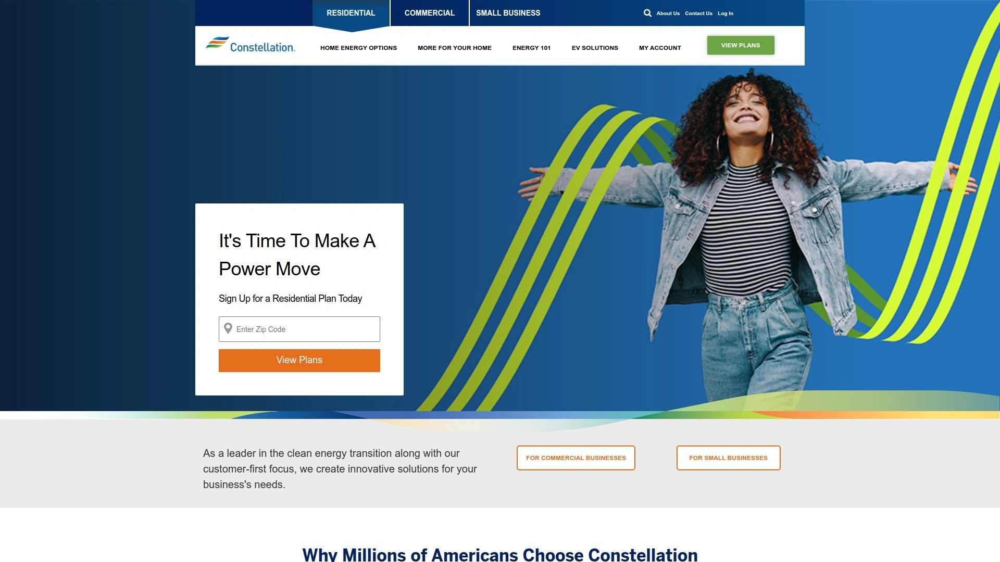

Constellation leads U.S. carbon-free energy production with ambitious goals to achieve 100% carbon-free generation by 2040 and 95% by 2030. The company serves residential and business customers across Connecticut, DC, Georgia, Illinois, Massachusetts, Maryland, New Jersey, New York, Ohio, Pennsylvania, and Texas.

Fixed-rate plans provide predictable monthly costs with usage bill credits—$35 for exceeding 1,000 kWh and an additional $15 for surpassing 2,000 kWh monthly. The 12 Month GREEN Usage Bill Credit plan matches your consumption with renewable energy certificates from wind and solar farms nationwide.

Beyond electricity supply, Constellation bundles home services including HVAC repairs, AC protection, and electric vehicle charging installation. The company contributed $18.7 million in 2023 supporting over 4,400 charities while employees logged 102,600 volunteer hours in community service.

Standard flat-rate plans charge similar rates across all usage tiers, delivering predictable bills whether you use minimal power in winter or blast AC in August. Contract lengths span 12, 24, and 36 months with $150-$295 early termination fees depending on term selected.

---

## **[Green Mountain Energy](https://www.greenmountainenergy.com)**

Oldest renewable retail electricity provider since 1997 helping customers avoid nearly 100 billion pounds of carbon emissions.

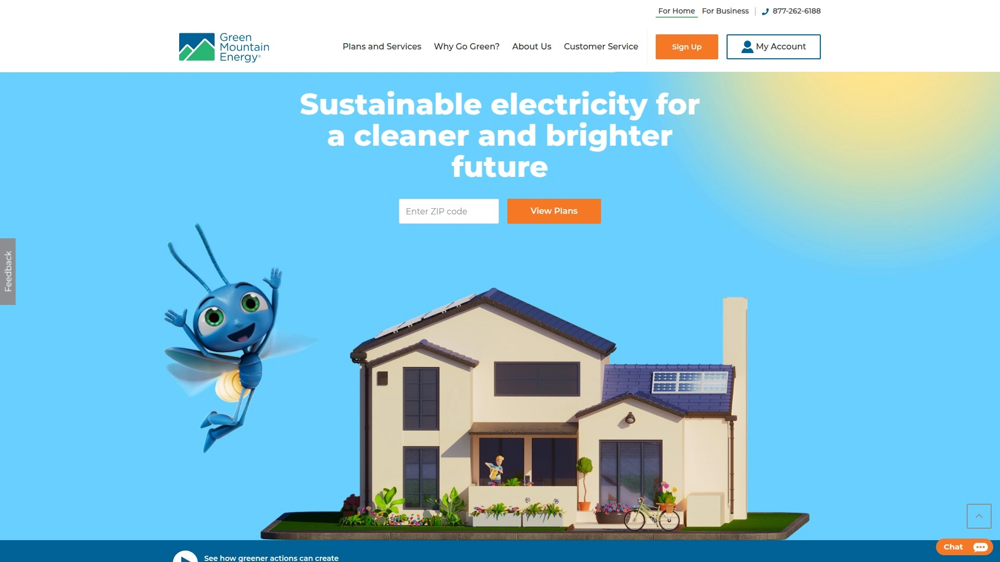

Green Mountain Energy pioneered renewable retail electricity when it launched in 1997, establishing the business model that dozens of newer competitors now follow. Operating in Texas, Pennsylvania, New York, Illinois, Massachusetts, New Jersey, and Maryland, the company has prevented nearly 100 billion pounds of carbon emissions through its renewable energy plans.

The carbon-neutral brand operates sustainably beyond just selling renewable electricity—leadership regularly pursues operational improvements and subjects financial books to annual third-party audits verifying environmental claims. This transparency addresses greenwashing concerns that plague less scrupulous competitors making unverifiable environmental promises.

Commercial customers of all sizes access tailored solutions whether pursuing clean energy for the first time or expanding current deployments. Green Mountain Energy tracks CO2 emissions prevented since 2002, allowing residential and commercial customers to quantify their positive environmental impacts with concrete numbers.

Plans include fixed-rate options providing billing stability alongside renewable energy sourcing that combines wind, solar, and other renewable generation technologies. The company's longevity in a competitive market demonstrates operational competence that newer entrants haven't yet proven.

***

## **[Inspire Clean Energy](https://www.inspirecleanenergy.com)**

Subscription-style clean energy delivering predictable monthly pricing across eight states plus Washington DC.

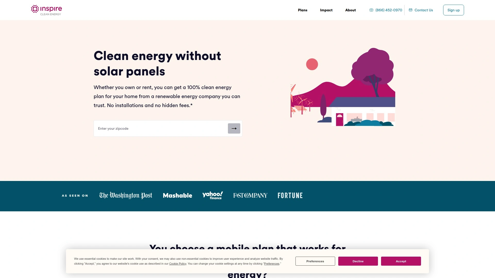

Inspire Clean Energy transforms electricity billing into subscription pricing with consistent monthly costs eliminating surprise spikes when usage fluctuates seasonally. This predictability benefits households on fixed incomes who need stable utility expenses rather than bills that double during heat waves or cold snaps.

The company operates across DC, Illinois, Massachusetts, Maryland, New Jersey, New York, Ohio, and Pennsylvania with 100% renewable electricity sourced from wind and solar. Customers report substantial business bill reductions with one reviewer expressing disbelief at the significant difference after switching.

Subscription plans maintain the same monthly charge regardless of consumption, though this pricing structure benefits moderate users more than extremely low or extremely high consumption households. For families with predictable electricity needs, the fixed monthly cost removes billing anxiety and simplifies budgeting.

Customer service receives mixed reviews—some praise the green energy commitment and order experience, while others report rate increases without adequate notice. Reviewing contract terms carefully before signing ensures understanding of rate adjustment policies and cancellation procedures.

***

## **[Octopus Energy](https://octopusenergy.com)**

Technology-focused renewable provider bringing affordable electricity to 17 million homes worldwide with Texas expansion.

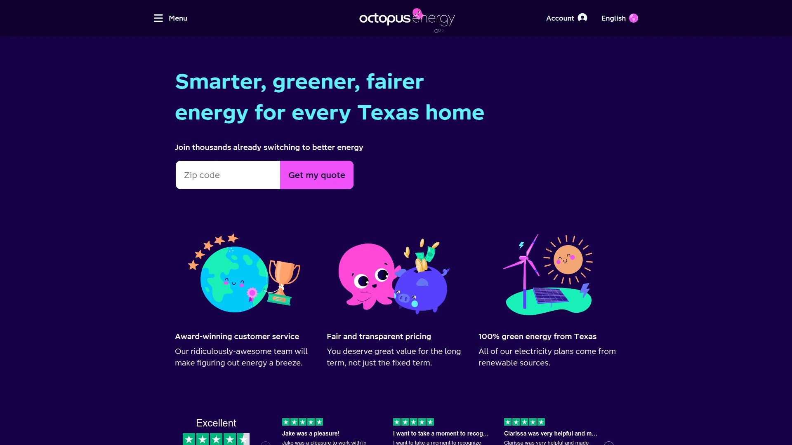

Octopus Energy leverages proprietary technology to reduce costs while delivering 100% renewable electricity, with systems already serving 17 million homes globally. The UK-based company expanded into Texas markets with plans to replicate its international success in competitive pricing and transparent renewable sourcing.

Advanced algorithms match customer usage levels to renewable energy generation, ensuring that consumption gets backed by actual wind and solar production rather than paper certificates alone. This technical approach provides more genuine renewable energy connection than providers simply purchasing credits to offset fossil fuel generation.

Among UK's 22 suppliers certified at 100% renewable fuel mix, Octopus Energy maintains competitive pricing alongside excellent customer service reputation. The company's market share growth demonstrates that customers value both environmental credentials and operational competence rather than choosing one over the other.

Texas-specific plans include fixed and variable rate options designed for residential customers seeking renewable electricity without complex contracts. The technology platform provides real-time usage data and transparent pricing that traditional utility companies rarely match.

***

## **[CleanSky Energy](https://cleanskyenergy.com)**

Mission-driven renewable energy company providing 100% wind-powered electricity and carbon-neutral natural gas across four states.

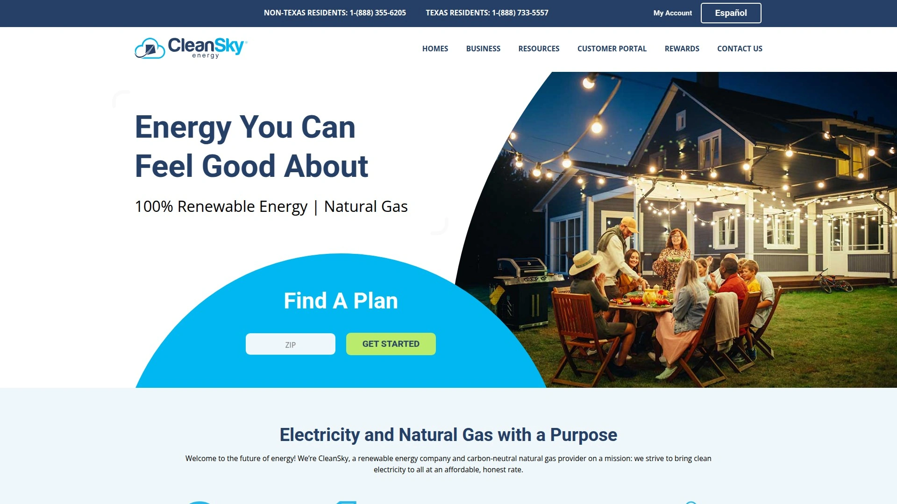

CleanSky Energy operates in Massachusetts, New Jersey, Illinois, and Maine with a mission focused on minimizing health and human tolls caused by pollution globally. The company provides fully transparent energy plans combining competitive pricing with zero emissions commitment.

Wind energy powers all residential electricity plans, with natural gas offerings ensuring any carbon emissions get neutralized through verified offset programs returning carbon back into the ground. This carbon-neutral natural gas approach addresses heating needs in cold climates where full electrification isn't yet practical.

Custom business energy plans get tailored by CleanSky's services team to reduce operating costs while supporting environmental goals. Commercial customers receive individualized pricing and service levels appropriate for their specific consumption patterns and sustainability objectives.

The company positions renewable energy as affordable and honest rather than premium-priced virtue signaling, challenging the outdated perception that clean electricity costs significantly more than fossil fuel generation. Straightforward plan structures avoid hidden fees and confusing tier pricing common among less transparent competitors.

***

## **[Think Energy](https://thinkenergy.com)**

Modern energy retailer offering AutoSave technology and community solar subscriptions with guaranteed savings and no installations.

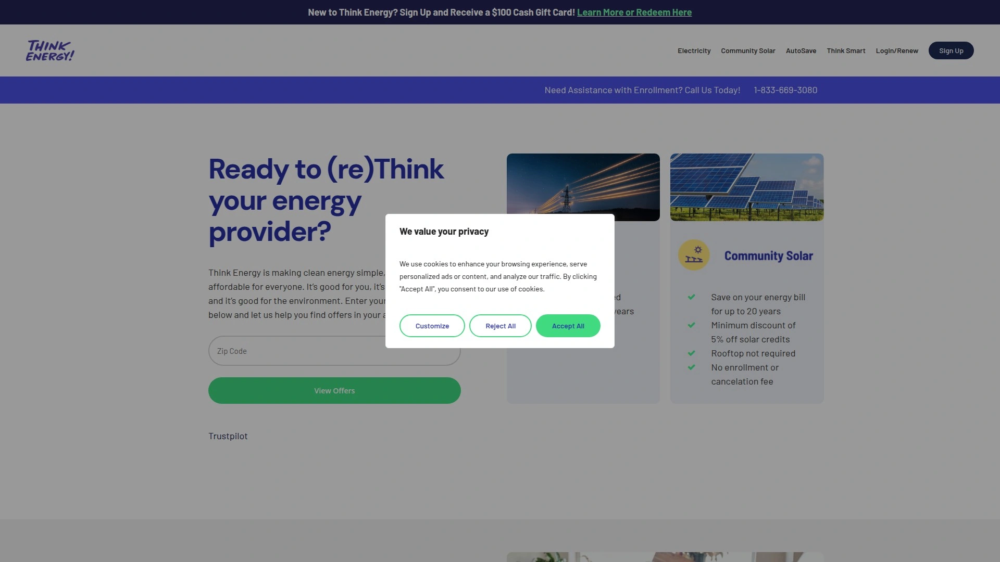

Think Energy built its platform around smart technology that actively monitors markets and adjusts rates automatically rather than requiring customers to track energy prices manually. The AutoSave feature eliminates the research burden that typically prevents people from getting better electricity deals.

Community solar subscriptions provide guaranteed monthly savings by connecting customers to local solar farms without panels, installations, or upfront costs. This model delivers tangible bill reductions for up to 20 years while supporting clean energy infrastructure in your actual community rather than distant generation facilities.

No long-term contracts lock customers into unfavorable terms, with plans designed for flexibility as circumstances change. The absence of hidden fees and transparent rate structures reflect the company's positioning as the antidote to confusing traditional utility billing.

Retail electricity plans complement community solar options, giving customers choice in how they access renewable power. Think Energy serves customers wanting control and cleaner sources without navigating complex energy markets or committing to expensive solar installations.

***

## **[Reliant Energy](https://www.reliant.com)**

Major Texas electricity provider offering diverse plan types including fixed-rate, prepaid, free nights, and renewable options.

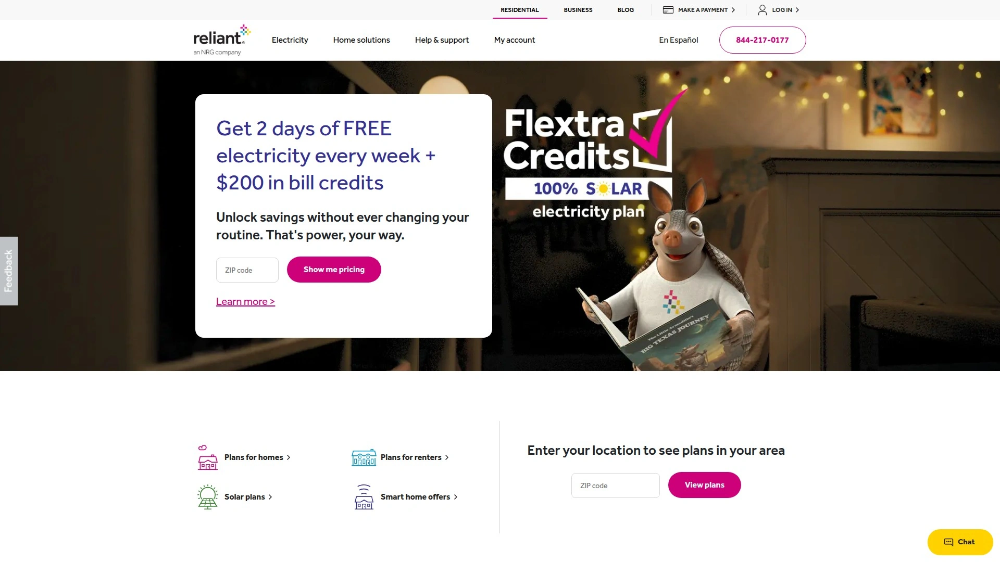

Reliant Energy operates as one of Texas's largest electricity providers with extensive plan selection spanning fixed-rate, variable-rate, time-of-use, and renewable energy options. The company donated millions to over 150 community programs across Texas, demonstrating operational scale and community investment.

Free nights and weekends plans provide electricity at no charge during specific hours, benefiting households that can shift major consumption to off-peak times. Fixed-rate plans lock in predictable pricing while month-to-month and prepaid options serve customers needing flexibility or credit-challenged individuals avoiding deposits.

Plans include renewable options though not all Reliant offerings source from 100% clean energy—customers specifically seeking renewable power should select designated green energy plans. Time-of-use plans reward strategic consumption timing, potentially delivering significant savings for tech-savvy households willing to run major appliances during discount windows.

Reliant's 20+ years serving millions of residential and business customers provides operational stability that newer market entrants lack. Customer service accessibility and plan variety make Reliant suitable for diverse household needs from basic service to complex usage optimization.

***

## **[Verde Energy](https://www.verdeenergy.com)**

Renewable energy provider leveraging deregulation savings to deliver environmentally sound electricity across seven states plus DC.

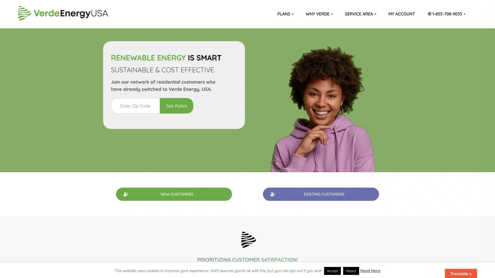

Verde Energy USA founded to help residents take advantage of state energy deregulation savings while transitioning toward renewable infrastructure. The company operates in Connecticut, DC, Massachusetts, New Jersey, New York, Ohio, and Pennsylvania with plans emphasizing competitive rates and environmental responsibility.

Customers report easy switching processes for both electric and gas service with clear communication about required actions. Cash-back savings enhance already competitive base rates, making renewable energy more affordable than many fossil fuel alternatives.

Reviews highlight good green energy rates without billing or customer service issues during normal operations. Fixed-income households specifically note substantial savings over previous providers, with some expressing gratitude for budget relief renewable energy pricing provided.

100% green electricity plans get verified through renewable energy certificates matching consumption to actual wind and solar generation. Verde Energy's commitment to economically sustainable renewable infrastructure acknowledges that environmental solutions must make financial sense for widespread adoption.

***

## **[Arcadia](https://www.arcadia.com)**

Energy broker connecting customers to clean wind energy and community solar with utility bill management technology.

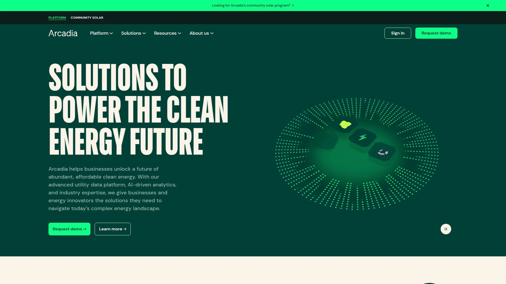

Arcadia operates as an energy company broker and utility bill management platform rather than direct electricity supplier, connecting customers to renewable sources through existing utility relationships. The platform manages billing by receiving payment from customers and forwarding it to utility companies while sourcing renewable energy certificates matching consumption.

Community solar connections deliver savings by linking households to local solar farms without equipment installations or upfront costs. The average Arcadia member offsets the equivalent of 712 pounds of coal monthly through renewable energy certificate purchases supporting actual wind generation.

Plans start with a Basic tier at 1.5¢ per kWh that matches 100% of energy use with clean wind power, providing affordable entry to renewable electricity. The technology platform handles complexity automatically—customers simply connect utility accounts and let Arcadia manage renewable sourcing and billing.

Because all electricity feeds into the same power grid before distribution, Arcadia cannot send renewable electrons directly to homes, but renewable energy certificates ensure that clean generation matches customer consumption. This model works nationwide regardless of local utility infrastructure limitations.

***

## **[CleanChoice Energy](https://cleanchoiceenergy.com)**

100% wind and solar electricity provider operating in eight states plus Washington DC with no cancellation fees.

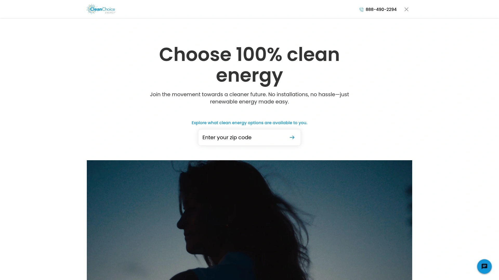

CleanChoice Energy supplies electricity replenished entirely by regional wind and solar generation, ensuring renewable energy comes from nearby sources rather than distant farms. The company operates across Delaware, Illinois, Massachusetts, Maryland, New Jersey, New York, Ohio, Pennsylvania, and Washington DC.

Plans include month-to-month options requiring no long-term commitment and 12-month fixed-rate contracts providing price stability. After initial contract periods expire, plans transition to variable month-to-month pricing with no cancellation fees allowing easy switching if better options emerge.

The Clean Planet plan offers a one-month contract for customers wanting to test CleanChoice without commitment, while Clean Pick and Clean World provide 12-month fixed rates securing pricing for a full year. All plans source from 100% renewable generation supporting wind and solar farms in your specific region.

Residential monthly bills average $125.85 though pricing varies by location and consumption patterns. CleanChoice serves customers prioritizing renewable electricity without complex contracts or cancellation penalties that traditionally lock people into unfavorable agreements.

***

## **[Gexa Energy](https://www.gexaenergy.com)**

Texas electricity provider specializing in 100% renewable plans with smart thermostat programs and EV-friendly options.

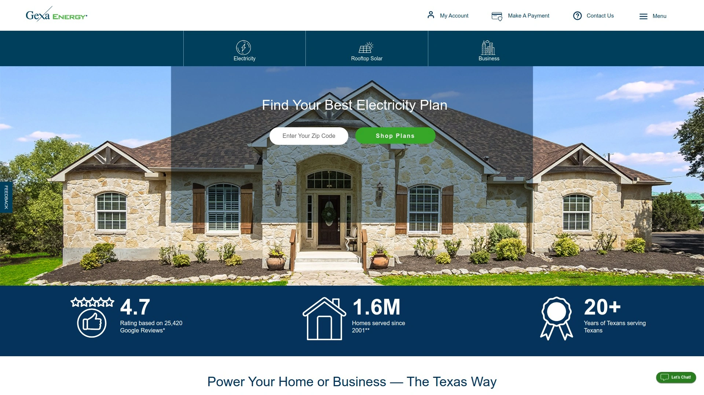

Gexa Energy focuses exclusively on Texas markets with 100% green energy plans backed by renewable energy credits matching all customer consumption. The company developed comprehensive solar solutions helping homeowners maximize rooftop solar investments through buyback programs and custom system design.

Smart thermostat promotions provide up to two free Sensi Touch thermostats with Energy Saver Plans, delivering up to 23% savings on heating and cooling costs through automated temperature control. EV-friendly plans include discounted overnight charging helping electric vehicle owners reduce home charging expenses.

Bill credit plans reward strategic consumption—Gexa Saver Deluxe offers $100 monthly credits for using 1,000-2,000 kWh while Saver Value provides $35-$50 credits at lower usage tiers. These incentive structures benefit moderate-to-high consumption households willing to maintain usage within specific ranges.

Contract terms span 12, 24, and 36 months with early termination fees ranging $150-$295 depending on plan length. Month-to-month variable pricing accommodates short-term residents or customers preferring flexibility over rate guarantees.

Solar buyback programs credit customers for excess solar generation sent back to the grid, maximizing home solar system value even when production exceeds consumption. This makes Gexa particularly suitable for Texas homeowners combining rooftop solar with grid electricity.

***

## **[NRG Energy](https://www.nrg.com)**

North America's largest energy provider delivering renewable electricity plans with cash back rewards and EV charging solutions.

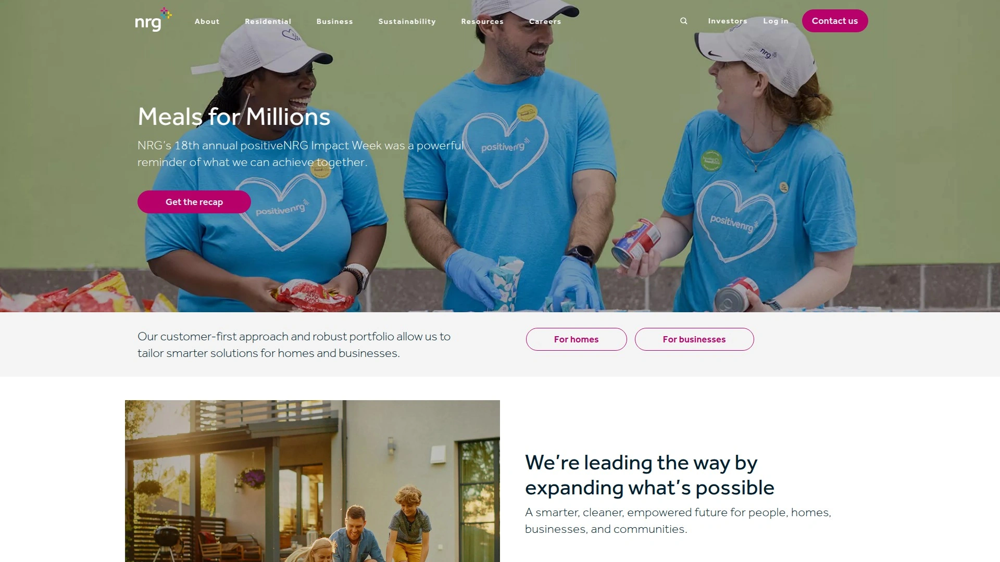

NRG Energy operates as North America's largest energy provider serving hundreds of thousands of customers across Midwest and Northeast regions. The company offers electricity and natural gas plans with perks spanning cash back rewards, travel benefits, renewable energy, and charitable contributions.

Renewable electricity plans purchase Renewable Energy Certificates equal to customer usage, funding renewable energy generation for the power grid. The 100% renewable plan with cash back rewards provides a $25 sign-up bonus after two months of service plus annual 1% cash back on every dollar spent on electricity supply charges.

Electric vehicle owners access exclusive 12-month fixed-rate plans with features designed specifically for EV charging needs and lifestyle. NRG's commitment to sustainable living extends beyond electricity into backup power, smart home technology, and home services creating comprehensive climate-neutral solutions.

The company's scale provides operational stability and customer service resources that smaller renewable startups cannot match. NRG combines renewable energy commitment with practical features like cash back and EV support that enhance value beyond simple electricity supply.

***

## **[Direct Energy](https://www.directenergy.com)**

Established electricity provider offering 24-100% renewable options across Texas with flexible contract lengths and solid customer support.

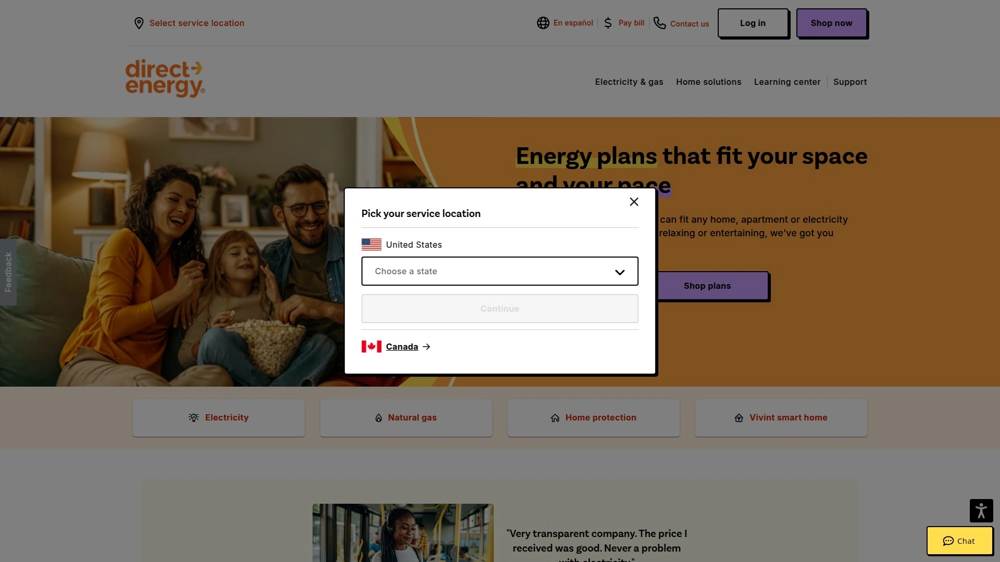

Direct Energy provides electricity plans with renewable energy percentages ranging from 24% to 100%, allowing customers to choose their environmental commitment level based on budget and priorities. Contract terms span 1, 12, 18, 24, and 36 months providing flexibility for various household situations.

The company offers give $50, get $50 bill credit rewards for customer recommendations with no limits on how many people you can refer. This unlimited structure provides ongoing value for satisfied customers willing to share their positive experiences with friends and family.

Plans include fixed-rate, variable-rate, and time-of-use options serving different consumption patterns and risk tolerances. Direct Energy emphasizes choice, simplicity, and innovation positioning itself as a customer-centric alternative to competitors prioritizing marketing over service.

Early termination fees apply to fixed-rate contracts though the company provides clear terms upfront rather than hiding penalties in fine print. Direct Energy's established market presence and transparent pricing make it suitable for Texas households wanting renewable options without sacrificing reliability or customer support.

***

## **[APG&E](https://www.apge.com)**

Straightforward energy solutions provider founded in 2004 delivering affordable renewable electricity across six states.

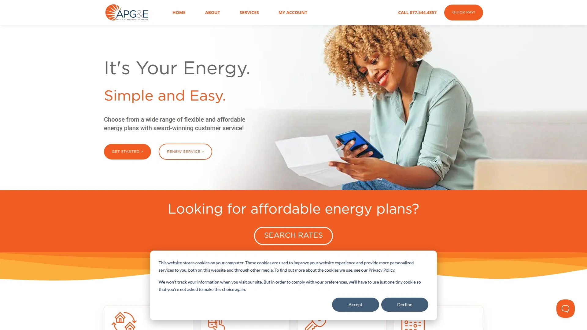

APG&E launched in Texas in 2004 and expanded to serve Maryland, New Jersey, New York, Ohio, and Pennsylvania with simple, transparent electricity plans. The company prioritizes helping customers make informed energy choices through clear product explanations and affordable pricing.

Plans emphasize simplicity over complexity—transparent pricing structures avoid confusing tiers and hidden fees that require spreadsheets to understand actual costs. This straightforward approach appeals to customers frustrated with traditional utility billing that obscures real per-kilowatt-hour charges beneath layers of fees and surcharges.

Renewable energy options get verified through standard industry certification ensuring that green energy claims match actual generation sources. APG&E serves both residential homes and businesses seeking reliable electricity supply without unnecessary complexity or inflated pricing.

The company's growth from single-state Texas provider to multi-state operation demonstrates competitive pricing and service quality that retains customers and attracts new ones. APG&E suits households wanting reliable renewable electricity without premium pricing or complicated contract terms.

***

## **FAQ**

**How quickly can I switch to a renewable energy provider?**

Most states with deregulated electricity markets allow switching within 1-2 billing cycles, typically 30-60 days from enrollment. Providers like CleanChoice Energy and Verde Energy handle cancellation with your current supplier automatically—you simply enroll and they coordinate the transition without service interruption. No equipment changes or installations are required since renewable electricity flows through the same power lines as traditional generation.

**Do renewable energy plans actually cost less than regular electricity?**

Yes, many renewable energy providers offer competitive or lower rates than standard utility pricing due to falling wind and solar generation costs. Companies like SmartEnergy, CleanSky Energy, and Verde Energy regularly undercut fossil fuel electricity rates while delivering 100% renewable power. Specific savings depend on your location, current utility rates, and consumption patterns, but the perception that green energy costs significantly more is outdated.

**What happens to my electricity during storms or when wind/solar generation is low?**

Your power stays on because renewable energy providers don't physically deliver electrons directly to your home—all electricity mixes on the shared grid regardless of generation source. Renewable energy certificates ensure that your consumption gets matched with clean generation elsewhere on the grid, while local utility infrastructure maintains actual power delivery. The grid's interconnected nature means renewable electricity effectively replaces fossil fuel generation without creating reliability issues.

***

## Conclusion

The renewable energy market has evolved beyond niche premium service into mainstream competitive pricing that makes environmental choices financially sensible. Switching to clean electricity no longer requires sacrificing convenience or paying substantially more—modern providers deliver genuine value alongside environmental benefits.

**[SmartEnergy](https://smartenergy.com)** stands out for households seeking diversified renewable sources backed by responsive customer service and transparent pricing across multiple states. The combination of solar, wind, hydro, and geothermal generation provides reliability while competitive rates make clean energy accessible rather than aspirational for everyday families committed to reducing their carbon footprint without budget strain.
